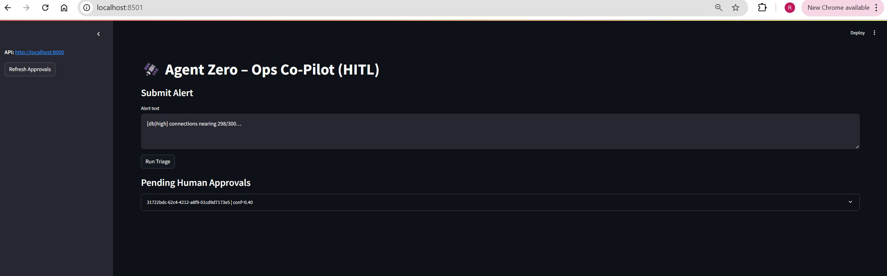
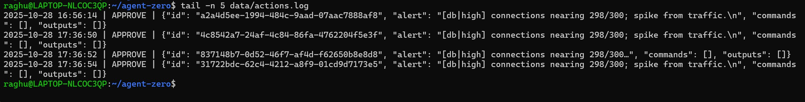

# Agent Zero – Ops Co-Pilot (HITL)

A tiny, real Agentic-AI system that triages ops alerts using RAG + LLM, then pauses for **Human-In-The-Loop (HITL)** approval before executing remediations. Built with **FastAPI**, **Streamlit**, and **ChromaDB**.

> Demo focus: **genAI + agents + safety**. Retrieval-augmented reasoning, confidence gating, approvals, and an **audit trail**.

---

## ✨ Features

- **RAG Memory:** Seeded incident knowledge base (Chroma persistent store)
- **LLM Triage:** Drafts a plan, commands, and risks for each alert
- **Confidence Gate:** Low-confidence items → **HITL queue**
- **HITL UI:** Approve/Reject with one click
- **Action Log:** Every approval writes to `data/actions.log` (audit-proof)
- **Switchable providers:** OpenAI (online, 1536-d) or Offline MiniLM (384-d)

<p align="center">
  
</p>

<p align="center">
  
</p>

<p align="center">
  
</p>

---

## 🧱 Architecture
```
Streamlit UI ──► FastAPI (/triage, /approvals/*)
│ │
│ ├─► Triaging Agent (LLM + rules)
│ │
▼ └─► Chroma (RAG: neighbors, context)
Pending Approvals ▲
│ │
└── Approve/Reject ───────────┘
│
└─► Executor (simulated) + actions.log (audit)
```
---

## 🛠️ Prereqs

- Python 3.11+ (works on 3.12)
- (Optional) Docker Desktop (only if you want Chroma via container; default is local persistent)
- (Optional) Ollama for fully offline LLMs
- OpenAI Platform account **if you use OpenAI embeddings / models**

---

## 🚀 Quickstart

### 1) Create env & install

```bash
python3 -m venv .venv
. .venv/bin/activate
pip install -U pip && pip install -r requirements.txt

```bash

### 2) Configure .env

OpenAI path (recommended for best vectors):
MODEL_PROVIDER=openai
OPENAI_API_KEY=sk-...        # from https://platform.openai.com/account/api-keys
OFFLINE_EMBED=false

CONFIDENCE_THRESHOLD=0.65
API_URL=http://localhost:8000
```
---

### 3) Seed RAG memory

make embed

- Output should end with: "Embedded 4 items. Offline=<True/False>"

If you switch OFFLINE_EMBED later, re-seed:
rm -rf data/chroma_local
make embed


---

### 4) Run the app

terminal A
make run-api     # http://localhost:8000 (Swagger: /docs)

terminal B
make run-ui      # http://localhost:8501

---

### Verification and Validation:

🧪 Try it

1. Open the UI → http://localhost:8501
2. Paste an alert like:
[db|high] connections nearing 298/300; spike from traffic.
3. Hit Run Triage

If confidence < threshold, item shows in Pending Human Approvals

Click Approve → simulated executor runs and audit is written

4. Check audit log:

tail -n 5 data/actions.log

Sample line: 2025-10-28 16:56:14 | APPROVE | {"id": "...", "alert": "[db|high] ...", "commands": ["ALTER SYSTEM ..."], "outputs": ["SIMULATED: ALTER SYSTEM ..."]}


---

### Key paths:

- src/ui/app.py – Streamlit UI

- src/api/main.py – FastAPI endpoints (/triage, /approvals/*)

- src/agent/triage_agent.py – RAG + LLM logic

- src/retrieval/vector_store.py – Chroma client + embedding function

- src/hitl/human_loop.py – queue + approval resolution

- src/utils/{store.py, executor.py, actions.py} – state, simulated executor, audit log

- data/chroma_local/ – local Chroma persistent store

- data/actions.log – audit trail (git-ignored)

---

### Troubleshooting

InvalidDimensionException (384 vs 1536)

You seeded with one embedding type and queried with another. Fix:

Set OFFLINE_EMBED consistently, then:

rm -rf data/chroma_local && make embed && restart API

UI shows 0.0.0.0:8501
That’s a bind address. Browse http://localhost:8501.

API port already in use:
sudo ss -ltnp | grep ':8000'
sudo kill -9 <PID>

Ollama permission denied
export OLLAMA_MODELS=$HOME/.ollama
pkill -f 'ollama serve' || true
nohup env OLLAMA_MODELS=$HOME/.ollama ollama serve >/tmp/ollama.log 2>&1 &
env OLLAMA_MODELS=$HOME/.ollama ollama pull llama3.1


---

### Tests & lint
```
make fmt     # black + ruff --fix
make lint    # ruff + black --check
pytest       # (add tests under tests/)
```
---

### License

MIT

---
